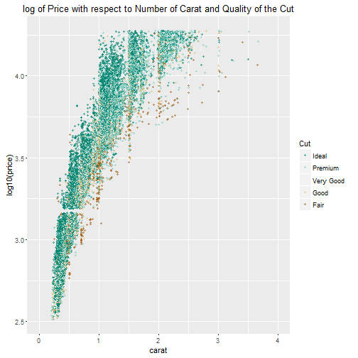
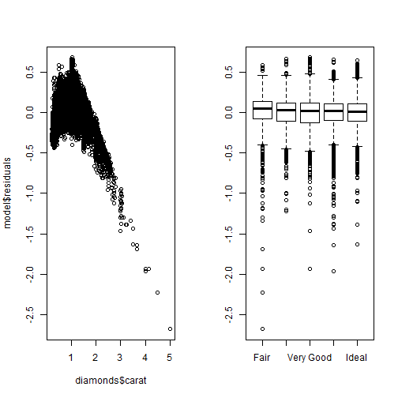

Data Products Project Pitch
========================================================
author: Solen Sanschagrin
date: February 28, 2016

========================================================

This very simple app gives an estimation of the price of round cut diamond based on the number of carats and the quality of the cut. The estimation is based on a model generated from the diamonds data available in the ggplot2 package.

Data 
========================================================

Model
========================================================
The model is taken as linear with respect to the log of the price using `lm(I(log10(price))~carat+cut,data=diamonds)`. As can be seen below on the residual plots, the predictions are good for all cut qualities but seem to overestimate price for high carat values. The number of carats in the app only goes up to 6 to limit extrapolation.

Conclusion
========================================================

This predictor could be a lot better but, at least, it works.
